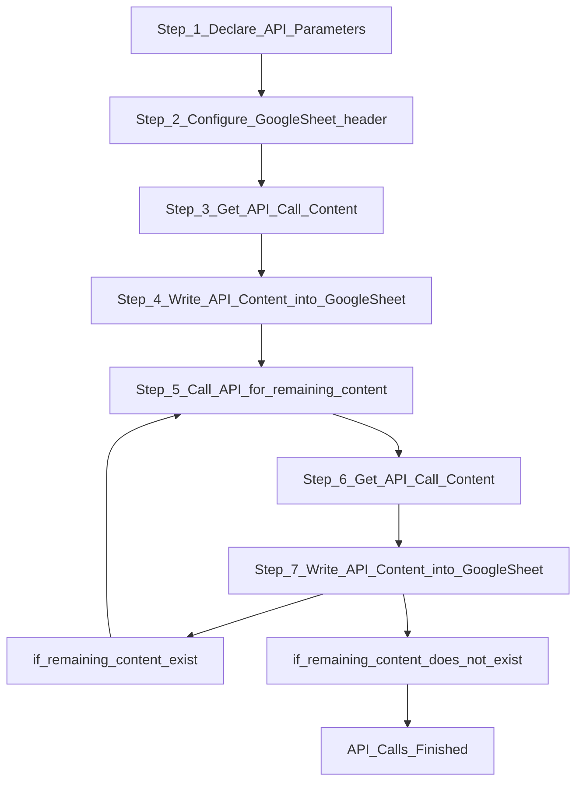

# AzurePrice
## Azure Retail Prices overview
https://learn.microsoft.com/en-us/rest/api/cost-management/retail-prices/azure-retail-prices

### Azure Price API JSON
```
{
            "currencyCode": "USD",
            "tierMinimumUnits": 0.0,
            "retailPrice": 0.176346,
            "unitPrice": 0.176346,
            "armRegionName": "westeurope",
            "location": "EU West",
            "effectiveStartDate": "2020-08-01T00:00:00Z",
            "meterId": "000a794b-bdb0-58be-a0cd-0c3a0f222923",
            "meterName": "F16s Spot",
            "productId": "DZH318Z0BQPS",
            "skuId": "DZH318Z0BQPS/00TG",
            "productName": "Virtual Machines FS Series Windows",
            "skuName": "F16s Spot",
            "serviceName": "Virtual Machines",
            "serviceId": "DZH313Z7MMC8",
            "serviceFamily": "Compute",
            "unitOfMeasure": "1 Hour",
            "type": "DevTestConsumption",
            "isPrimaryMeterRegion": true,
            "armSkuName": "Standard_F16s"
        }
```
Here is a simple flow chart:




## URI Conventions (OData Version 2.0)
https://www.odata.org/documentation/odata-version-2-0/uri-conventions/


## Google Sheet
https://docs.google.com/spreadsheets/d/1UoMHFPPySJuxAf70cw_SSlds6m0Ih35IcLXgptkCpL8/edit?usp=sharing

## Google Apps Script
https://script.google.com/home/start

## Reference
Introduction to the Azure Pricing API including examples
https://davecallan.com/azure-price-api-examples/
