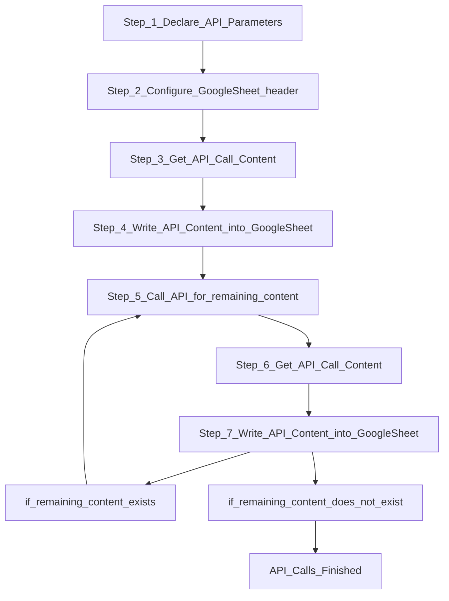

# AzurePrice
## Azure Retail Prices overview
https://learn.microsoft.com/en-us/rest/api/cost-management/retail-prices/azure-retail-prices

### Azure Price API JSON
```
{
            "currencyCode": "USD",
            "tierMinimumUnits": 0.0,
            "retailPrice": 0.176346,
            "unitPrice": 0.176346,
            "armRegionName": "westeurope",
            "location": "EU West",
            "effectiveStartDate": "2020-08-01T00:00:00Z",
            "meterId": "000a794b-bdb0-58be-a0cd-0c3a0f222923",
            "meterName": "F16s Spot",
            "productId": "DZH318Z0BQPS",
            "skuId": "DZH318Z0BQPS/00TG",
            "productName": "Virtual Machines FS Series Windows",
            "skuName": "F16s Spot",
            "serviceName": "Virtual Machines",
            "serviceId": "DZH313Z7MMC8",
            "serviceFamily": "Compute",
            "unitOfMeasure": "1 Hour",
            "type": "DevTestConsumption",
            "isPrimaryMeterRegion": true,
            "armSkuName": "Standard_F16s"
        }
```
Here is a simple flow chart:


### Step_1_Declare_API_Parameters
```javascript
function APIParameters(){
  const AzurePriceLink = "https://prices.azure.com/api/retail/prices?api-version=2023-01-01-preview&currencyCode='USD'&$filter="
  const serviceFamily = "serviceName eq 'Virtual Machines'"
  const armRegionName = "armRegionName eq 'eastasia'"
//priceType :[ DevTestConsumption , Consumption , Reservation ]
  const priceType = "priceType eq 'DevTestConsumption'"   
  const meterName = "contains(meterName, 'Spot') eq false"
  const APIParametersresult = AzurePriceLink.concat([serviceFamily,armRegionName,priceType,meterName].join(' and '))
  console.log(APIParametersresult);
  return APIParametersresult;
}
//Call Azure Price API and Declare API Parameters
  let response = UrlFetchApp.fetch(APIParameters());
  let data = JSON.parse(response);
```

### Step_2_Configure_GoogleSheet_header
```javascript
function headerConfig(sheet){
  const header =1
  const headerlist=[
    "productName",
    "skuName",
    "armSkuName",
    "meterName",
    "armRegionName",
    "location",
    "retailPrice",
    "unitPrice",
    "currencyCode" ,
    "unitOfMeasure",
    "type",
    "reservationTerm",
    "savingsPlan_unitPrice_3_Years",
    "savingsPlan_retailPrice_3_Years",
    "savingsPlan_term_3_Years",
    "savingsPlan_unitPrice_1_Years",
    "savingsPlan_retailPrice_1_Years",
    "savingsPlan_term_1_Years"       
    ]
  for( headerColumn = 0 ; headerColumn < headerlist.length ; headerColumn++){
     sheet.getRange(header,headerColumn+1).setValue(headerlist[headerColumn]); 
  }
}
```
### Step_3_Get_API_Call_Content
```javascript
//Get Azure Price API Content
  for ( RowID = 0; RowID < data.Items.length; RowID++) {
//Write API Content into Google Sheet
    Value=fetchedcontentRowConfig(RowID,data);
    for( ValueColumn = 0 ; ValueColumn < Value.length ; ValueColumn++){
      sheet.getRange(fetchedcontentRow,ValueColumn+1).setValue(Value[ValueColumn]); 
    }
    fetchedcontentRow++; 
  }
```
### Step_4_Write_API_Content_into_GoogleSheet
```javascript
function fetchedcontentRowConfig(RowID,data){
//Service Name
  const productName = data.Items[RowID].productName;
  const skuName = data.Items[RowID].skuName;
  const armSkuName = data.Items[RowID].armSkuName;
  const meterName = data.Items[RowID].meterName;
//region & location
  const armRegionName = data.Items[RowID].armRegionName;
  const location = data.Items[RowID].location;
// Service retail Price
  const retailPrice = data.Items[RowID].retailPrice;
  const unitPrice = data.Items[RowID].unitPrice;
  const unitOfMeasure = data.Items[RowID].unitOfMeasure;
//other
  const type = data.Items[RowID].type;
  const reservationTerm = data.Items[RowID].reservationTerm;
  const currencyCode = data.Items[RowID].currencyCode;
//Saving Plan
if("savingsPlan" in data.Items[RowID]){
    savingsPlan_unitPrice_3_Years = data.Items[RowID].savingsPlan[0].unitPrice;
    savingsPlan_retailPrice_3_Years=data.Items[RowID].savingsPlan[0].retailPrice
    savingsPlan_term_3_Years=data.Items[RowID].savingsPlan[0].term;
    savingsPlan_unitPrice_1_Years=data.Items[RowID].savingsPlan[1].unitPrice;
    savingsPlan_retailPrice_1_Years=data.Items[RowID].savingsPlan[1].retailPrice;
    savingsPlan_term_1_Years =data.Items[RowID].savingsPlan[1].term;
}else{
  savingsPlan_unitPrice_3_Years =" ";
  savingsPlan_retailPrice_3_Years=" ";
  savingsPlan_term_3_Years=" ";
  savingsPlan_unitPrice_1_Years=" ";
  savingsPlan_retailPrice_1_Years=" ";
  savingsPlan_term_1_Years =" ";
}
  return [
    productName,
    skuName,
    armSkuName,
    meterName,
    armRegionName,
    location,
    retailPrice,
    unitPrice,
    currencyCode,
    unitOfMeasure,
    type,
    reservationTerm,
    savingsPlan_unitPrice_3_Years,
    savingsPlan_retailPrice_3_Years,
    savingsPlan_term_3_Years,
    savingsPlan_unitPrice_1_Years,
    savingsPlan_retailPrice_1_Years,
    savingsPlan_term_1_Years 
    ]
}
```
### Step_5_Call_API_for_remaining_content
```javascript
//Call API for remaining content
  console.log(data.NextPageLink);
  response = UrlFetchApp.fetch(data.NextPageLink);
  data = JSON.parse(response);
  console.log(data.NextPageLink);
```
### Step_6_Get_API_Call_Content and Step_7_Write_API_Content_into_GoogleSheet
```javascript
  while ("NextPageLink" in data) {
//Get API Call Content
    for ( RowID = 0; RowID < data.Items.length; RowID++) {
//Write API Content into Google Sheet
      Value=fetchedcontentRowConfig(RowID,data);
      for( ValueColumn = 0 ; ValueColumn < Value.length ; ValueColumn++){
        sheet.getRange(fetchedcontentRow,ValueColumn+1).setValue(Value[ValueColumn]); 
      }
      fetchedcontentRow++;
    }
//if remaining content does not exist
    if(data.NextPageLink == null){
      //API Calls Finished
      break;
    }
//if the remaining content exists
    response = UrlFetchApp.fetch(data.NextPageLink);
    data = JSON.parse(response);
    console.log(data.NextPageLink);
  }
```


## URI Conventions (OData Version 2.0)
https://www.odata.org/documentation/odata-version-2-0/uri-conventions/


## Google Sheet
https://docs.google.com/spreadsheets/d/1UoMHFPPySJuxAf70cw_SSlds6m0Ih35IcLXgptkCpL8/edit?usp=sharing

## Google Apps Script
https://script.google.com/home/start

## Reference
Introduction to the Azure Pricing API including examples
https://davecallan.com/azure-price-api-examples/
